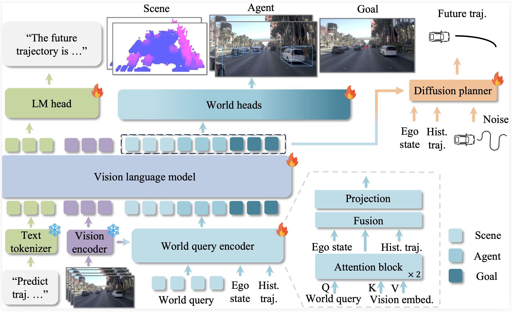

<div align="center">
<!--  -->
<h1>SGDrive</h1>
<h3>SGDrive: Scene-to-Goal Hierarchical World Cognition for Autonomous Driving</h3>

Jingyu Li<sup>1,2\*</sup>, Junjie Wu<sup>3\*</sup>, Dongnan Hu<sup>4,2</sup>, Xiangkai Huang<sup>3</sup>, Bin Sun<sup>3†</sup>, Zhihui Hao<sup>3†</sup>,  
Xianpeng Lang<sup>3</sup>, Xiatian Zhu<sup>5</sup>, [Zhang Li](https://lzrobots.github.io/)<sup>1,2✉</sup>  

<sup>1</sup>Fudan University  <sup>2</sup>Shanghai Innovation Institute
<sup>3</sup> Li Auto Inc. <sup>4</sup> Tongji University <sup>5</sup> University of Surrey

(\*) Equal contribution. (†) Project leader. (✉) Corresponding author.  

Arxiv 2025

<a href="[https://arxiv.org/abs/2601.05640](https://arxiv.org/abs/2601.05640)"></a>
</div>


</div>

## News
* **` Jan. 09th, 2026`:** We released our paper on [Arxiv](https://arxiv.org/abs/2601.05640). Code/Models are coming soon. Please stay tuned! ☕️


## Updates
- [x] Release Paper
- [ ] Release Full Models and Training/Evaluation Framework

## Table of Contents
- [News](#news)
- [Updates](#updates)
- [Abstract](#abstract)
- [Getting Started](#getting-started)
- [Driving Pretraining Datasets](#driving-pretraining-datasets)
- [Qualitative Results on NAVSIM Navtest](#qualitative-results-on-navsim-navtest)
- [Contact](#contact)
- [Acknowledgement](#acknowledgement)
- [Citation](#citation)

## Abstract         

Recent end-to-end autonomous driving approaches have leveraged Vision-Language Models (VLMs) to enhance planning capabilities in complex driving scenarios. However, VLMs are inherently trained as generalist models, lacking specialized understanding of driving-specific reasoning in 3D space and time. When applied to autonomous driving, these models struggle to establish structured spatial-temporal representations that capture geometric relationships, scene context, and motion patterns critical for safe trajectory planning.
To address these limitations, we propose SGDrive, a novel framework that explicitly structures the VLM's representation learning around driving-specific knowledge hierarchies. Built upon a pre-trained VLM backbone, SGDrive decomposes driving understanding into a scene-agent-goal hierarchy that mirrors human driving cognition: drivers first perceive the overall environment (scene context), then attend to safety-critical agents and their behaviors, and finally formulate short-term goals before executing actions. This hierarchical decomposition provides the structured spatial-temporal representation that generalist VLMs lack, integrating multi-level information into a compact yet comprehensive format for trajectory planning. Extensive experiments on the NAVSIM benchmark demonstrate that SGDrive achieves state-of-the-art performance among camera-only methods on both PDMS and EPDMS, validating the effectiveness of hierarchical knowledge structuring for adapting generalist VLMs to autonomous driving.

<div align="center">

</div>


## Getting Started

- [Download NAVSIM datasets following official instruction](https://github.com/autonomousvision/navsim/blob/main/docs/install.md)
- [Preparation of SGDrive environment](docs/Installation.md)
- [SGDrive Training and Evaluation](docs/Train_Eval.md)

## Checkpoint

> Results on NAVSIM


| Method | Model Size | Training Method | PDMS | Weight Download(coming soon) |
| :---: | :---: | :---: | :---: |  :---: |
| SGDrive-VLM | 2B | Q&A SFT | 85.5 | [Model](https://github.com/LogosRoboticsGroup/SGDrive) | |
| SGDrive-IL | 2B  | SFT | 87.4 | [Model](https://github.com/LogosRoboticsGroup/SGDrive) | |
| SGDrive-RL | 2B  | RFT | 91.1 | [Model](https://github.com/LogosRoboticsGroup/SGDrive) | |

| Method | Model Size | Training Stage | EPDMS | Weight Download(coming soon) |
| :---: | :---: | :---: | :---: |  :---: |
| SGDrive-IL | 2B  | SFT | 86.2 | [Model](https://github.com/LogosRoboticsGroup/SGDrive) | |


## Qualitative Results on NAVSIM Navtest 
<div align="center">
  
</div>
<p align="left">
  Our qualitative results demonstrate strong alignment with ground truth across the scene–agent–goal hierarchy, indicating rich driving-world knowledge and reliable short-horizon representation.
</p>

<div align="center">
  
</div>
<p align="left">
  SGDrive adaptively perceives the driving scene according to the ego-vehicle's motion state and navigation command.  This demonstrates a more structured and effective representation of driving-relevant world knowledge, providing strong evidence that \netName{} successfully elicits the VLM's world-modeling ability.
</p>

<div align="center">
  
</div>
<p align="left">
  We compare SGDrive (SFT) with ReCogDrive, both of which leverage structured driving-world knowledge and can extrapolate it reasonably to ensure safe and rational driving behavior. More visualizations are in the supplementary material.
</p>


## Contact
If you have any questions, please contact Jingyu Li via email (jingyuli24@m.fudan.edu.cn).

## Acknowledgement
SGDrive is greatly inspired by the following outstanding contributions to the open-source community: [NAVSIM](https://github.com/autonomousvision/navsim), [RecogDrive](https://github.com/xiaomi-research/recogdrive), [GR00T](https://github.com/NVIDIA/Isaac-GR00T).


## Citation
If you find SGDrive is useful in your research or applications, please consider giving us a star 🌟 and citing it by the following BibTeX entry.

```bibtex
@misc{li2026sgdrivescenetogoalhierarchicalworld,
      title={SGDrive: Scene-to-Goal Hierarchical World Cognition for Autonomous Driving}, 
      author={Jingyu Li and Junjie Wu and Dongnan Hu and Xiangkai Huang and Bin Sun and Zhihui Hao and Xianpeng Lang and Xiatian Zhu and Li Zhang},
      year={2026},
      eprint={2601.05640},
      archivePrefix={arXiv},
      primaryClass={cs.CV},
      url={https://arxiv.org/abs/2601.05640}, 
}
```

